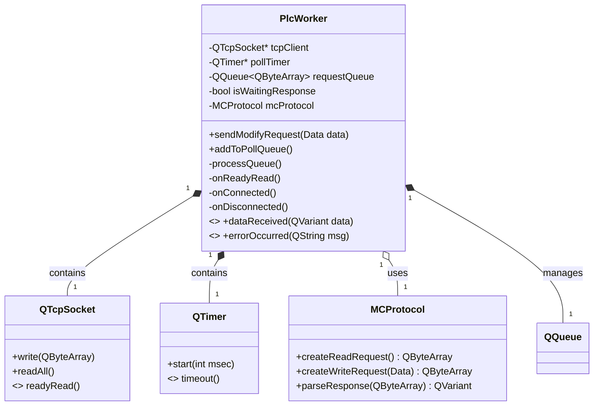

```mermaid
classDiagram
    class PlcWorker {
        -QTcpSocket* tcpClient
        -QTimer* pollTimer
        -QQueue~QByteArray~ requestQueue
        -bool isWaitingResponse
        -MCProtocol mcProtocol
        +sendModifyRequest(Data data)
        +addToPollQueue()
        -processQueue()
        -onReadyRead()
        -onConnected()
        -onDisconnected()
        <<signal>> +dataReceived(QVariant data)
        <<signal>> +errorOccurred(QString msg)
    }

    class QTcpSocket {
        +write(QByteArray)
        +readAll()
        <<signal>> readyRead()
    }

    class QTimer {
        +start(int msec)
        <<signal>> timeout()
    }

    class MCProtocol {
        +createReadRequest() QByteArray
        +createWriteRequest(Data) QByteArray
        +parseResponse(QByteArray) QVariant
    }

    PlcWorker "1" *-- "1" QTcpSocket : contains
    PlcWorker "1" *-- "1" QTimer : contains
    PlcWorker "1" o-- "1" MCProtocol : uses
    PlcWorker "1" *-- "1" QQueue : manages
```