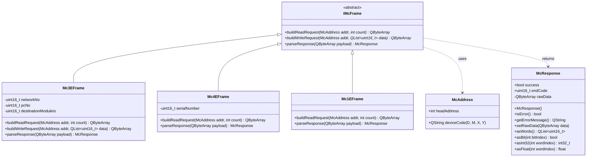

```mermaid
classDiagram
    class IMcFrame {
        <<abstract>>
        +buildReadRequest(McAddress addr, int count)* QByteArray
        +buildWriteRequest(McAddress addr, QList~uint16_t~ data)* QByteArray
        +parseResponse(QByteArray payload)* McResponse
    }

    class Mc3EFrame {
        -uint16_t networkNo
        -uint16_t pcNo
        -uint16_t destinationModuleIo
        +buildReadRequest(McAddress addr, int count) QByteArray
        +buildWriteRequest(McAddress addr, QList~uint16_t~ data) QByteArray
        +parseResponse(QByteArray payload) McResponse
    }

    class Mc4EFrame {
        -uint16_t serialNumber
        +buildReadRequest(McAddress addr, int count) QByteArray
        +parseResponse(QByteArray payload) McResponse
    }

    class Mc1EFrame {
        +buildReadRequest(McAddress addr, int count) QByteArray
        +parseResponse(QByteArray payload) McResponse
    }

    class McAddress {
        +QString deviceCode (D, M, X, Y)
        +int headAddress
    }

    class McResponse {
        +bool success
        +uint16_t endCode
        -QByteArray rawData
        
        +McResponse()
        +isError() bool
        +getErrorMessage() QString
        
        +setRawData(QByteArray data)
        +asWords() QList~uint16_t~
        +asBit(int bitIndex) bool
        +asInt32(int wordIndex) int32_t
        +asFloat(int wordIndex) float
    }

    IMcFrame <|-- Mc3EFrame
    IMcFrame <|-- Mc4EFrame
    IMcFrame <|-- Mc1EFrame
    IMcFrame ..> McAddress : uses
    IMcFrame ..> McResponse : returns
```